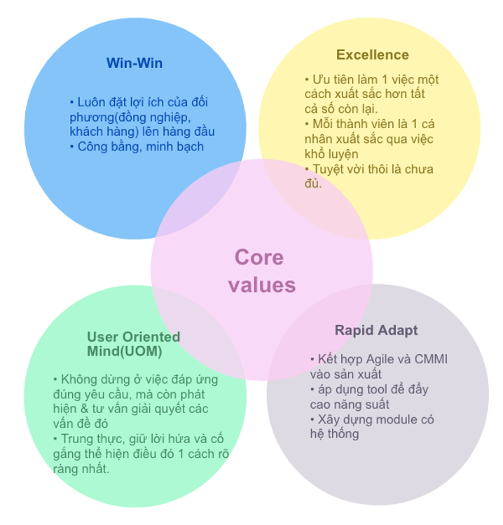
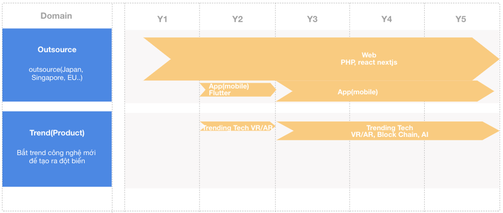

#1. Giá trị cốt lõi
W E R U = WE ARE YOU

#2. Sứ mệnh/Mission

- Phát hiện & giải quyết các bài toán của xã hội bằng công nghệ thông tin(IT). 
- Xây dựng môi trường để các thành viên được học tập, phát triển không ngừng về năng lực, địa vị, lợi ích. 
- Luôn giữ vững tinh thần năng động nhiệt huyết của người khởi nghiệp.

#3. Vision

Keyword: Agile, Cloud, XaaS, RPA, AI, BlockChain, IoT, Analytics, Mobility, 5G, UX/UI, DevOps, Security, SaaS, Robotics, Digital Sollution, Platform, Network

#4. Phương châm hành động 2022

## 1. Tăng quy mô Div lên 25-30 mem

| O1  | Tăng quy mô Div lên 25-30 mem                                         | Type    | Owner      |
| --- | --------------------------------------------------------------------- | ------- | ---------- |
| KR1 | Phát hiện, đào tạo 1 PM                                               | Cam kết | Loi.Nguyen |
| KR2 | Đào tạo 3 IT Comtor                                                   | Mở rộng | Dung.Do2   |
| KR3 | Đào tạo 2 junior PHP                                                  | Cam kết | Ninh.Tran  |
| KR4 | Đào tạo 4 junior Tester                                               | Cam kết | Toan.Phan  |
| KR5 | Đào tạo 2 junior Reactjs                                              | Mở rộng | Cuong.Tong |
| KR6 | Tuyển dụng nhân sự: 1 Techlead, 1 COM, 1 BE, 4 FE, 1 Mobile, 3 Tester | Cam kết | Dung.Do2   |

## 2. Đạt mục tiêu doanh thu, lợi nhuận >=10%

| O2  | Đạt mục tiêu doanh thu, lợi nhuận >=10% | Type    | Owner               |
| --- | --------------------------------------- | ------- | ------------------- |
| KR1 | Doanh thu 240 mm                        | Cam kết | Dung.Do2            |
| KR2 | CSS của tất cả dự án >=80               | Cam kết | PM                  |
| KR3 | Chi phí trung bình xuống 23m/ng         | Mở rộng | Dung.Do2/Loi.Nguyen |

## 3. Học công nghệ mới(VR/AR)

| O3  | Học công nghệ mới(VR/AR)          | Type    | Owner      |
| --- | --------------------------------- | ------- | ---------- |
| KR1 | Hoàn thành 3 khóa cơ bản về VR/AR | Cam kết | Loi.Nguyen |
| KR2 | Hoàn thành 1 dự án về VR/AR       | Cam kết | Loi.Nguyen |
